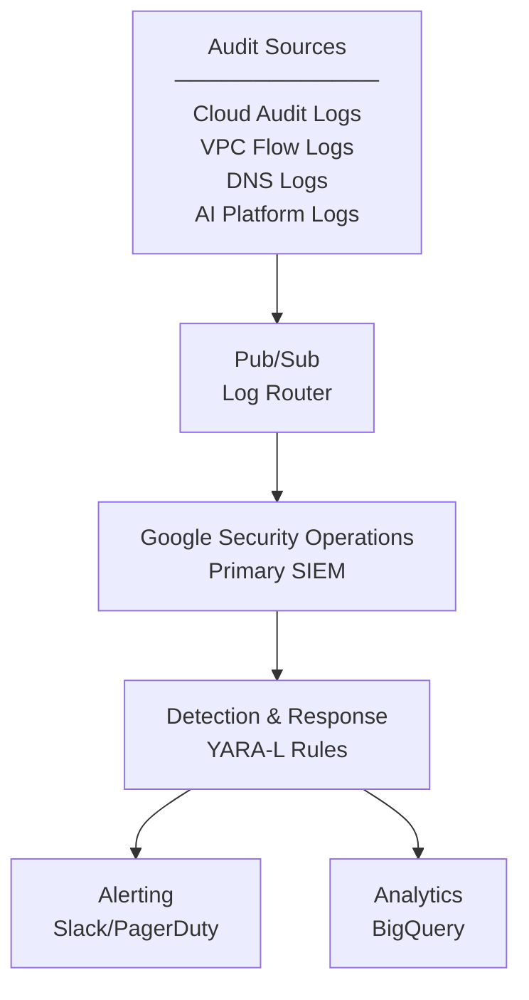

# Secure GenAI Application on GCP

A production-ready, security-focused GenAI application infrastructure using Terraform.

## Architecture
- **Security**: IAP, VPC-SC, encrypted storage, least-privilege IAM
- **AI/ML**: Vertex AI, Gemini API, vector embeddings
- **Data**: AlloyDB with pgvector, Cloud Storage for RAG
- **Compute**: Cloud Run with VPC access
- **Monitoring**: Budget alerts, audit logging, cost controls

## Security Features
1. **Zero Trust Access**: IAP-protected Cloud Run service
2. **Encryption at Rest**: CMEK for storage and databases
3. **Network Security**: VPC-SC, private endpoints, flow logs
4. **Secrets Management**: Secret Manager for credentials
5. **Audit Trail**: Cloud Logging to Google Security Operations (formerly Chronicle)

### Defense in Depth

| Layer | Function | Implementation |
|-------|----------|----------------|
| 1 | **Prevention** | VPC-SC, IAP, CMEK |
| 2 | **Detection** | Google Security Operations |
| 3 | **Response** | Real-time Cloud Functions |
| 4 | **Investigation** | Google Security Operations |
| 5 | **Compliance** | Audit logs preserved for 7 years |

### Security Architecture

## Deployment
1. Enable billing and required APIs
2. Configure terraform.tfvars
3. Initialize: `terraform init`
4. Plan: `terraform plan`
5. Apply: `terraform apply`

## Access
Application is secured with IAP. Configure access in GCP Console.

## Development
See cloudbuild.yaml for CI/CD pipeline using Cloud Build.

